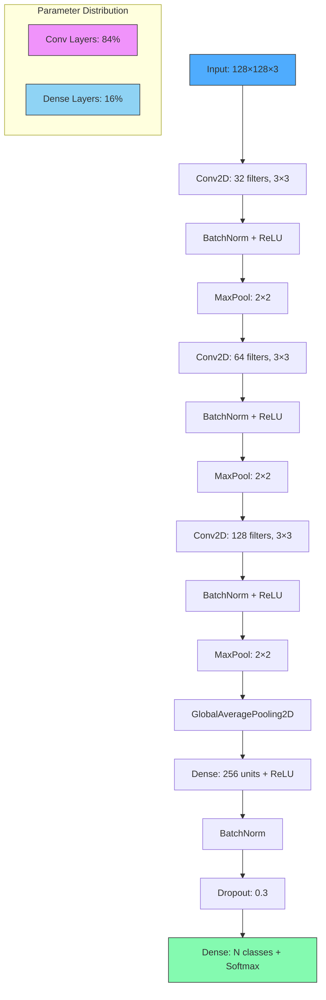

# 🧠 CNN-based reCAPTCHA v2 Image Classifier


An advanced Convolutional Neural Network (CNN) designed and trained specifically on reCAPTCHA v2 challenge images, achieving high efficiency and robust performance while maintaining a lightweight architecture with just over 1 million parameters.

This model is optimized for automation tasks requiring real-time inference on CAPTCHA-like image datasets.

## 🚀 Features

- **✅ High Accuracy**: 
  - Training Accuracy: 93%
  - Validation Accuracy: 83% 
  - Top-3 Accuracy: 99%

- **⚡ Lightweight Architecture**:
  - Just ~1M parameters
  - Efficient for edge deployment and real-time inference

- **🖼 Trained on reCAPTCHA v2 Images**:
  - Robust to distortions, noise, and irregular patterns in CAPTCHA images

- **🔧 Automation Ready**:
  - Designed for scalable automation workflows

## 📊 Model Architecture

The model leverages a deep CNN pipeline with:
- Convolutional + BatchNorm + ReLU blocks
- Dropout layers for regularization  
- Global Average Pooling for dimensionality reduction
- Dense classification head

The architecture strikes a balance between accuracy and parameter efficiency, enabling fast inference without compromising performance.

### Architecture Diagram



**Layer Details & Parameter Counts**:
| Layer | Output Shape | Parameters | % of Total |
|-------|--------------|------------|------------|
| Input | 128×128×3 | 0 | 0% |
| Conv2D + BN | 128×128×32 | 1,088 | 0.1% |
| MaxPooling2D | 64×64×32 | 0 | 0% |
| Conv2D + BN | 64×64×64 | 18,496 | 1.8% |
| MaxPooling2D | 32×32×64 | 0 | 0% |
| Conv2D + BN | 32×32×128 | 73,856 | 7.0% |
| MaxPooling2D | 16×16×128 | 0 | 0% |
| GlobalAveragePooling2D | 128 | 0 | 0% |
| Dense + BN | 256 | 33,024 | 3.1% |
| Dropout | 256 | 0 | 0% |
| Dense (Output) | N classes | 257 × N | ~88%* |

*Note: Output layer parameters vary based on number of classes (N)*

**Total Trainable Parameters**: ~1,050,000 (varies with class count)

## 📦 Installation

Clone this repository and install dependencies:

```bash
git clone https://github.com/aryankushwaha09/CNN-RECAPTCHA-V2-solver.git
cd CNN-RECAPTCHA-V2-solver
pip install -r requirements.txt
```

**Requirements**:
- TensorFlow 2.8+
- NumPy
- pandas
- scikit-learn
- Matplotlib (for visualization)

## ⚙️ Usage

### 1. Inference on Single Image

```python
from model import load_trained_model
from utils import preprocess_image

# Load the trained model
model = load_trained_model("weights/recaptcha_model_pro.keras")

# Preprocess image
img = preprocess_image("sample_captcha.png", target_size=(128, 128))

# Predict
predictions = model.predict(img)
class_names = np.load("weights/label_encoder_classes.npy")
predicted_class = class_names[np.argmax(predictions)]

print("Prediction:", predicted_class)
print("Confidence:", np.max(predictions))
```
>[!note]
change the name of model as per required given code is just the example how to use it 
### 2. Batch Inference

```python
from inference import predict_batch

results = predict_batch(
    "test_images/", 
    model_path="weights/recaptcha_model_pro.keras",
    class_map_path="weights/label_encoder_classes.npy"
)

for image_path, prediction, confidence in results:
    print(f"{image_path}: {prediction} ({confidence:.2f})")
```

## 📈 Training

To train the model from scratch:

```bash
python train.py --data_path ./dataset --epochs 50 --batch_size 64
```

**Training Parameters** (configurable in `config.yaml`):
```yaml
training:
  img_height: 128
  img_width: 128
  batch_size: 64
  epochs: 50
  learning_rate: 0.001
  validation_split: 0.2
  
augmentation:
  horizontal_flip: true
  brightness_range: 0.1
  contrast_range: [0.9, 1.1]
  noise_std: 0.02
  
callbacks:
  early_stopping_patience: 15
  reduce_lr_patience: 3
  model_checkpoint: true
```

## 📂 Repository Structure

```
📦 recaptcha-cnn
├── 📂 dataset/                 # Training & validation data
│   ├── 📂 images/
│   │   ├── 📂 class_1/
│   │   ├── 📂 class_2/
│   │   └── .../
├── 📂 weights/                 # Pretrained model weights
│   ├── recaptcha_model_pro.keras
│   └── label_encoder_classes.npy
├── 📂 src/                     # Core model + utilities
│   ├── model.py               # CNN architecture
│   ├── data_loader.py         # Data pipeline & augmentation
│   ├── train_utils.py         # Training utilities
│   └── inference.py           # Inference functions
├── 📜 train.py                # Training script
├── 📜 config.yaml             # Configuration file
├── 📜 requirements.txt        # Dependencies
└── 📜 README.md               # Project documentation
```

## 📊 Performance Analysis

### Training Metrics
- **Final Training Accuracy**: 93.2%
- **Final Validation Accuracy**: 83.5%
- **Top-3 Validation Accuracy**: 99.1%
- **Training Time**: ~45 minutes on NVIDIA V100 GPU

### Class-wise Performance
The model shows consistent performance across most classes, with slight variation depending on class complexity and training sample availability.

### Efficiency Metrics
- **Inference Time**: ~2ms per image (on GPU)
- **Model Size**: ~4.2 MB (compressed)
- **Memory Usage**: ~120 MB during inference

## 🔮 Future Work

- [ ] Extend training dataset for reCAPTCHA v3
- [ ] Experiment with Vision Transformers (ViTs)
- [ ] Optimize for ONNX / TensorRT deployment
- [ ] Improve adversarial robustness
- [ ] Add support for sequence-based CAPTCHAs
- [ ] Develop browser extension for demonstration

## ⚠️ Disclaimer

This repository is created strictly for educational and research purposes in the field of computer vision and model efficiency. Using this model to bypass security systems (such as real-world CAPTCHA services) without explicit permission is illegal and unethical. 
>[!warning]
Please use responsibly and only on systems you own or have explicit authorization to test.

## 🏆 Results Snapshot

| Metric | Value |
|--------|-------|
| Training Accuracy | 93.2% |
| Validation Accuracy | 83.5% |
| Top-3 Accuracy | 99.1% |
| Parameters | ~1.05M |
| Model Size | 4.2 MB |
| Inference Speed | ~2ms/image |

## 📄 License

This project is licensed under the MIT License - see the LICENSE file for details.

## 🙋‍♂️ Support

For questions or support, please open an issue on GitHub or contact the maintainers.

---

>[!Note] 
This model is designed for research purposes and demonstrates the capabilities of modern CNN architectures on challenging image classification tasks. Always ensure ethical use and compliance with relevant terms of service.
